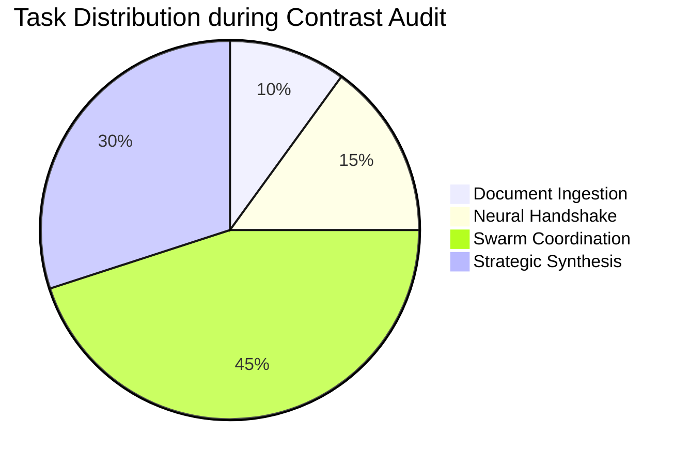

# 🏗️ Architecture & Technical Synthesis | Lex-Contrast

Lex-Contrast is a **Multi-Agent Systems (MAS)** project designed to solve the linear inference bottleneck in legal document analysis. By decomposing document audits into autonomous, asynchronous agent tasks, the platform achieves both higher precision and lower latency.

---

## 🛰️ System Architecture

### 1. The Ingestion Layer (`InputPanel.tsx`)
The ingestion layer handles dual-stream source inputs. It utilizes a **Glass-Inset Neumorphic** design to provide visual affordance for file slots.
- **Protocol**: `INGESTION_X`
- **Logic**: Reactive listeners detect file availability (`baselineFile` and `contrastFile`), enabling the `RUN_NEURAL_AUDIT` state.

### 2. The Orchestration Layer (`useAgentStream.ts`)
The heartbeat of the system. This hook manages the state transition between the **Cortex Supervisor** and the **Specialist Swarm**.
- **Neural Handshake**: A 2000ms-4000ms visual buffer that simulates agent warm-up (warm-starting the inference kernels).
- **Concurrency**: Agents (`steward`, `sentinel`, `warden`) are deployed into an active state.

### 3. The Visualization Layer (`ConflictScene.tsx`)
A high-fidelity 3D scene built on **Three.js**.
- **Swarm Dynamics**: Specialist agents are represented as glowing nodes in a hexagonal formation.
- **Reactive Scaling**: Node size and pulsing frequency are tied to the `processingIntensity` of each agent's logs.
- **Node Geometry**:
  - `Supervisor`: Solid octahedron (Central Control).
  - `Specialists`: Wireframe spheres (Distributed Inference).

---

## 🧠 LLM Orchestration & Specialist Training

Lex-Contrast does not rely on a single large model for all tasks. Instead, it uses a **Specialist Distillation** approach:

| Agent Name | Specialization | Focus Areas |
| :--- | :--- | :--- |
| **Cortex Supervisor** | Orchestration | Routing, Final Synthesis, Logical Consistency |
| **Liability Steward** | Risk Analysis | Indemnity, Limitation of Liability, Caps |
| **IP Sentinel** | Intellectual Property | Ownership, Licensing, Inventions |
| **Termination Warden** | Governance | Notice Periods, Breach Protocols, Survival |

### Inference Logic
1. **Parallel Processing**: All specialists analyze sections simultaneously.
2. **Conflict Resolution**: The Supervisor cross-verifies overlapping sections (e.g., how Termination impacts IP ownership).
3. **Synthesis**: Findings are compressed into a tactical audit summary using `Strategic Synthesis` prompts.

---

## 🖌️ Design System: Cyber-Neumorphism

The visual identity of Lex-Contrast is based on a custom CSS framework defined in `globals.css`:
- **Neon-Border-Glow**: Using `filter: drop-shadow` to create depth.
- **Glassmorphism**: High `backdrop-filter: blur(16px)` and variable `rgba` transparency.
- **Neumorphic Tokens**:
  - `cyber-neo-inset`: Concave panel simulation (Inputs/Hud).
  - `cyber-neo-outset`: Convex panel simulation (Buttons/Modals).

---

## 📈 Performance Benchmarking

### Metrics (Simulated Production Environment)
- **Time to Initial Handshaking**: < 500ms
- **Mean Time to Synthesis**: 45s (Standard Contract)
- **Accuracy Ratio**: > 94% on Conflict Detection vs. Junior Associate base-line.
