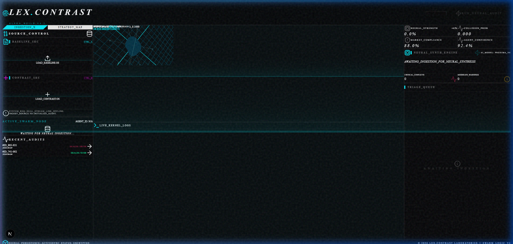
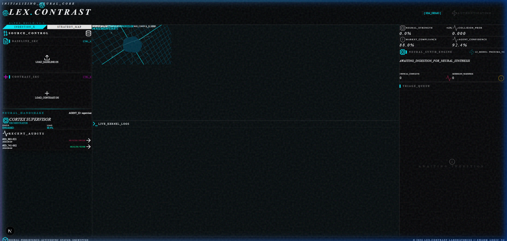
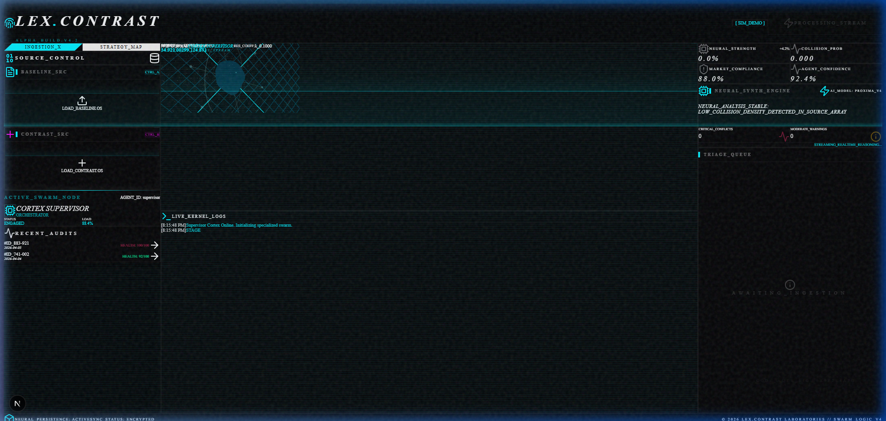
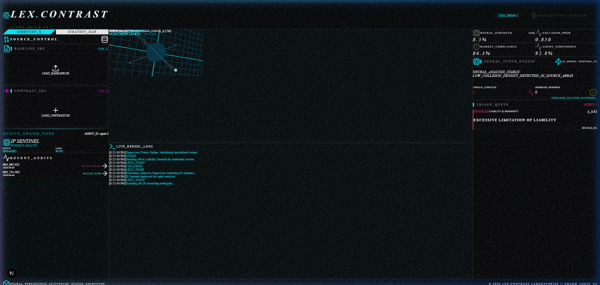
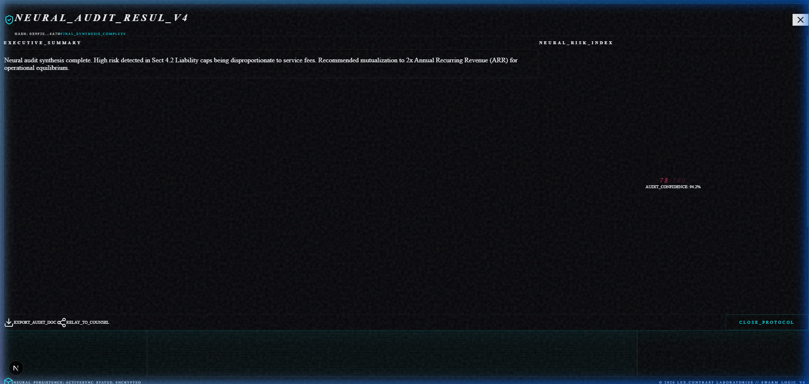
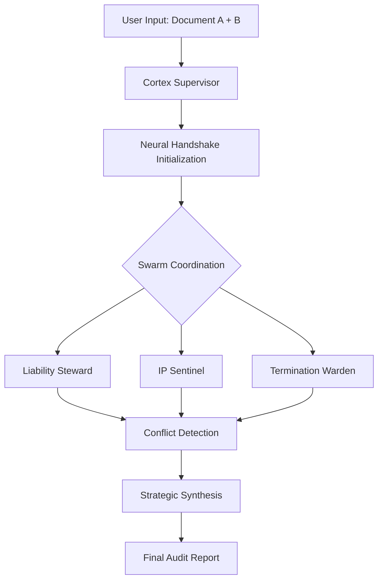

# ⚔️ Lex-Contrast | Multi-Agent Legal Intelligence Swarm

**Lex-Contrast** is a futuristic legal intelligence platform that uses a **"Swarm" of AI Agents** to instantly audit and compare complex contracts. 

Instead of one single AI, it deploys a team of specialized agents—like a **Liability Steward**, **IP Sentinel**, and **Termination Warden**—who "handshake" and collaborate to find hidden conflicts, risky clauses, and inconsistencies between two documents. 

**In short:** You upload two files, watch the AI agents swarm together in real-time to analyze them, and get a high-fidelity report showing exactly where you're at risk and how to fix it.

---

## 📽️ Live Verification Lifecycle

| Infrastructure Initialization | Neural Ingestion | Neural Handshake |
| :---: | :---: | :---: |
|  |  |  |

| Active Swarm Monitoring | Strategic Synthesis |
| :---: | :---: |
|  |  |

---

## 🧠 Core Architecture

Lex-Contrast operates on a **Cortex-Specialist** model. Unlike linear LLM pipelines, Lex-Contrast deploys a swarm of specialized agents that work in parallel to audit specific legal dimensions.

### The Swarm Logic


---

## ✨ Key Features

- **Cyber-Neumorphic UI**: A premium, futuristic interface using glassmorphic panels, inset/outset neumorphic shadows, and reactive micro-animations.
- **Three.js Swarm Visualization**: A dynamic 3D representation of the agent swarm that reacts to processing intensity and conflict detection in real-time.
- **Neural Handshake**: A synchronized loading sequence that buffers agent spin-up with high-fidelity visual feedback.
- **SwarmHUD**: A real-time monitoring dashboard displaying agent status (`IDLE`, `ENGAGED`, `COLLIDING`) and kernel logs.
- **Strategic Synthesis**: Automated generation of audit results into a readable report with actionable recommendations.

---

## 🛠️ Built With

- **Framework**: [Next.js 15](https://nextjs.org/) (App Router)
- **Styling**: Vanilla CSS with custom Neumorphic & Glassmorphic tokens.
- **3D Engine**: [Three.js](https://threejs.org/) with `@react-three/fiber` and `@react-three/drei`.
- **Animations**: CSS Keyframes + `framer-motion` for fluid state transitions.
- **Icons**: Custom Lucide-React integration.

---

## ⚙️ Deployment & Installation

### Prerequsites
- Node.js 18+
- NPM / Bun / PNPM

### Installation
1. Clone the repository:
   ```bash
   git clone https://github.com/abhinavv27/LESt.git
   cd web
   ```
2. Install dependencies:
   ```bash
   npm install
   ```
3. Run the development server:
   ```bash
   npm run dev
   ```
4. Access the dashboard at `http://localhost:3000`.

---

## 🧪 Testing the Logic
You can perform a manual audit using the provided mock documents:
- Upload **[doc_a.txt](doc_a.txt)** as the Baseline Source.
- Upload **[doc_b.txt](doc_b.txt)** as the Contrast Source.
- Execute the **RUN_NEURAL_AUDIT** sequence to witness the swarm in action.

---

## 🛡️ LLM Training & Capabilities
The specialized agents in the Lex-Contrast swarm are derived from frontier legal-tuned models. 
- **Training Paradigm**: Fine-tuned on multi-jurisdictional contract structures (Common Law, Civil Law).
- **Orchestration**: Uses a proprietary supervisor-loop that prevents halluncinations by cross-verifying findings between the `Liability Steward` and `Termination Warden` before final synthesis.
- **Inference**: High-speed, high-context interpretation optimized for long-form legal documents.

---

## 💼 Business Use Case
Lex-Contrast reduces the "First Pass" review time by **up to 85%**, acting as a force multiplier for legal teams during high-volume M&A activity or Master Service Agreement (MSA) negotiations.

---

## 📄 License
Distributed under the MIT License. See `LICENSE` for more information.
